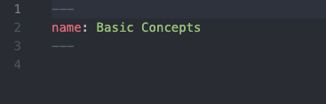
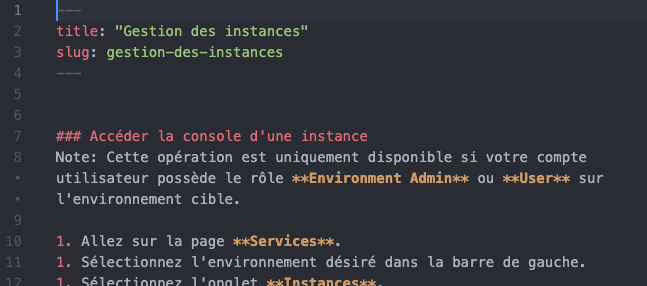
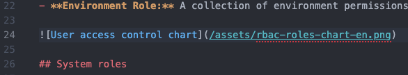
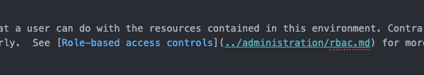
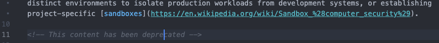

<!-- Need to add information about inheritance and branding. -->

The CloudMC knowledge base is the source for information related to the operation and administration of the CloudMC system.  It is designed to be highly customizable for the needs of each enterprise.  Articles, categories, and languages may be added or removed as desired.

The knowledge base is accessed from the user interface by going to the Help menu and clicking on Help Center.  Authentication is not necessary for accessing the Help Center, which can also be accessed directly via its URL.

Content is stored in a Git repository and is manually retrieved for local storage by CloudMC.  All articles are written in standard Markdown format, and can include images, references to other articles in the knowledge base, external links, and other features.  A given category can be marked as **featured**, and will have a larger icon and will be arranged above the other categories in the Help Center.

Resellers and administrators working with the CloudMC knowledge base will need basic familiarity with Git tools and the Markdown format.  

Managing the knowledge base requires the **Reseller** role, or the **Administrator** role with the *Knowledge base: Manage* role applied.

To manage the knowledge base, click on *Administration* in the sidebar on the left, then click on *Knowledge base*.

### Quick Start

1. Git clone the CloudMC standard knowledge base repository to your local workstation:  https://github.com/cloudops/cloudmc-standard-kb <!-- Rephrase this in v2, and also rename directory!!!! Also, git remote remove origin then git remote add origin ...-->
1. Explore the top-level directory structure:
   - The `assets` directory contains all images.
   - Each supported language has a directory, for example `en` for English-language content, and `fr` for French.
   - The `layout.yaml` file defines the categories and the articles contained within each category.
1. Make the desired customizations to the knowledge base, and save your commits.
1. Create a new empty public repository and push the knowledge base repository from your workstation to the new repository.
1. Verify that your repository is publicly accessible and that the contents of the repo appear as expected.
1. Navigate to the *Knowledge base* page.
1. Click on the button labeled *Create new knowledge base*.
1. A dialog box will appear, asking for the URL of the repository to use for the knowledge base.  Enter it into the text field and click *Confirm*.
1. CloudMC will grab the contents of the repository, and all categories and articles will be listed.  The content may now be viewed under the Help Center.

### Structure of the knowledge base repository

The knowledge base repository has the following structure:

```
/				(Top directory)
|- README.md
|- layout.yaml  		(Defines categories)
|- assets/  			(Contains all graphics)
|- en/				(English language)
   |- category1/		(Category directory)
      |- category1.md	        (Category file)
      |- article1.md	        (Article file)
      |- article2.md
   |- category2/		
      |- category2.md
      |- article3.md
|- fr/				(French language)
   |- category1/
      |- category1.md
      |- article1.md
      |- article2.md
   |- category2/
      |- category2.md
      |- article3.md
   |- ...                       (And so on)
```

The `README.md` file is a requirement of the Git tool.  It can be an empty, zero-byte file.

#### The assets directory

CloudMC will search in the `assets` directory for images referenced from the article files.  Supported image formats include JPEG, GIF, and PNG.

#### Languages

CloudMC can be configured for multiple language support via the [Brand Management](../administration/brand.md) page.  For each enabled language, a top-level directory may be created in the knowledge base repository for content in that language.  The name of the directory must be the ISO 639-1 code for the language, in lower-case letters, for example, `en` for English, `fr` for French, or `es` for Spanish.

If an enabled language does not have a top-level directory in the repository, content will not appear for that language in the Help Center.

The names of all files and directories are in English, regardless of the language of the content. This is arbitrary and may be changed as desired.  The only requirement is that the file- and directory names be the same for all languages, consistent with their specification in the `layout.yaml` file.

#### Categories

Each category has its own directory within a language directory.  The name of this directory must match the name of the category in `layout.yaml`.

Inside each category directory is a category file.  The name of the category file must be the name of the category with the extension `.md`.  The category file is a YAML-formatted file which contains one line that defines the title of the category to display in the knowledge base for the given language:



Because each category in each language has its own category file, the title of the category in that language is specified here.

**Note:** The name of each category directory *must* be identical in all languages, as specified in `layout.yaml` (see below).  The name of the category displayed in the user interface will be taken from the contents of the category file.

#### The layout.yaml file

The `layout.yaml` file is a YAML-formatted list of categories.  Each block in the file specifies a category and its details.  Familiarity with YAML is not necessary, but it is critical to maintain the original structure and indentation in the file when adding new categories or articles.
   - `category`: The name of the directory where a category file and the articles in that category reside.
   - `icon`: The name of the Font Awesome icon to use for the category.  See the External links section for a list of the Font Awesome icons available for use within the Help Center.
   - `featured`: A **true** or **false** value to indicate whether a category should be highlighted in the Help Center.  This field may be omitted, the default is **false**.
   - `articles`: An indented list of the names of the article files to include in that category.

#### Articles

Article files have a short YAML header:



   - The `title` field defines what text appears in the category listings and on the top line of each article.
   - The `slug` field defines what path will display in the URL in the browser’s location bar.

After the YAML header, the body of the article follows, and uses standard Markdown.  Images can be referenced in a regular reference using the path `/assets/filename`:



Other knowledge base articles can be referenced as a regular link.  Use a relative path to reference an article in another category:



Links to external content as well as HTML comments work as expected (the text within the comment will not appear in the Help Center):



**Note:** The name of each article file *must* be identical in all languages, as specified in `layout.yaml`.  The name of the article displayed in the user interface will be taken from the contents of the article file.

### Synchronizing with a repository

When changes have been committed to the `master` branch of your repository, a sync is required make the changes available in the Help Center.  Be aware that although a given repository may have multiple working branches, CloudMC pulls exclusively from the `master` branch.

1. Navigate to the *Knowledge base* page.
1. Click on the button labeled *Synchronize from repository*.
1. A notification will appear when the sync is complete.  Also, the **Latest synchronization** field will be updated.  The newly update content will now appear in the Help Center.

### See also

[Brand Management](../administration/branding.md)

### External links

[Git version control system](https://git-scm.com/)

[Markdown guide](https://www.markdownguide.org/)

[Font Awesome icons](https://fontawesome.com/v4.7.0/icons/)

[List of ISO 639-1 codes](https://en.wikipedia.org/wiki/List_of_ISO_639-1_codes)

# Broken

```
!$[User access control chart](/assets/rbac-roles-chart-en.png)
```

Other knowledge base articles can be referenced as a regular link.  Use a relative path to reference an article in another category:

```
$[Role-based access controls](../administration/rbac.md)
```

Links to external content as well as HTML comments work as expected (the text within the comment will not appear in the Help Center):

```
[sandboxes](https://en.wikipedia.org/wiki/Sandbox_%28computer_security%29)

<!-- This content has been deprecated -->
```
