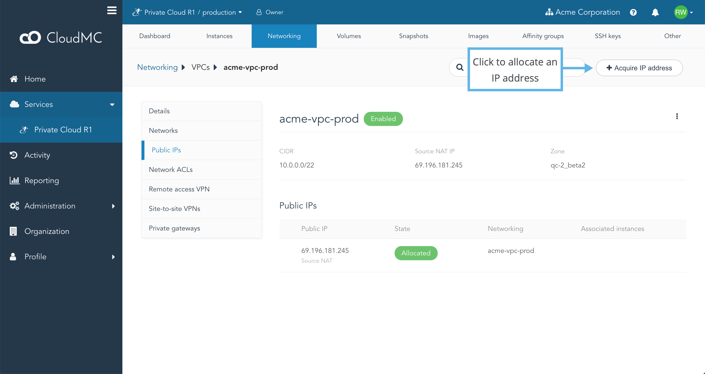
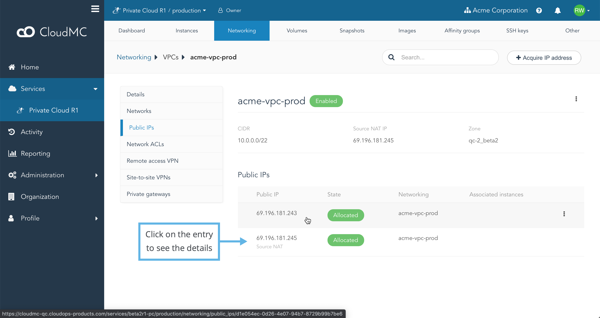
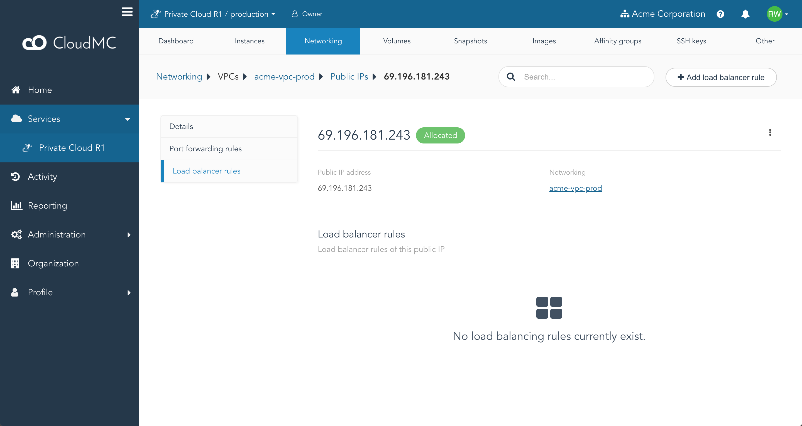
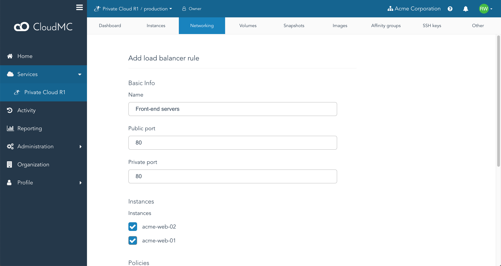
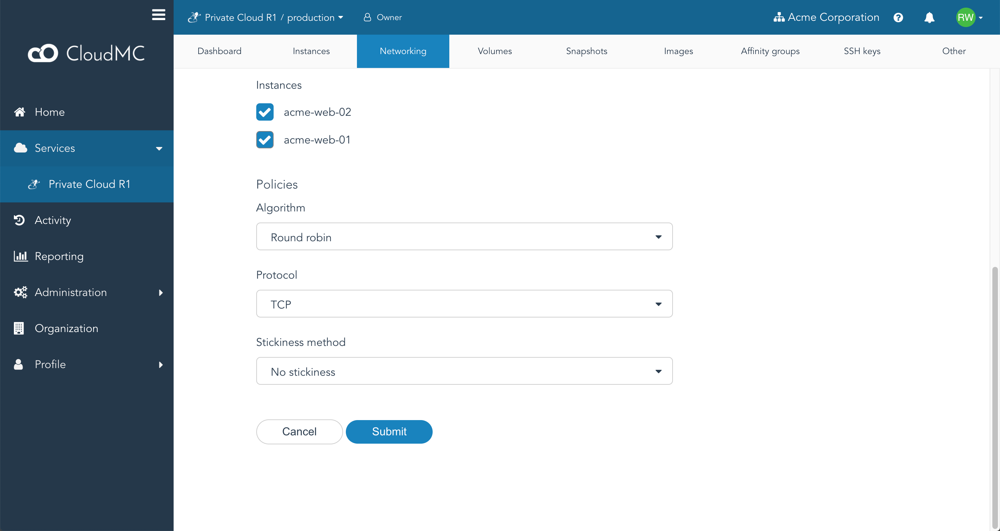
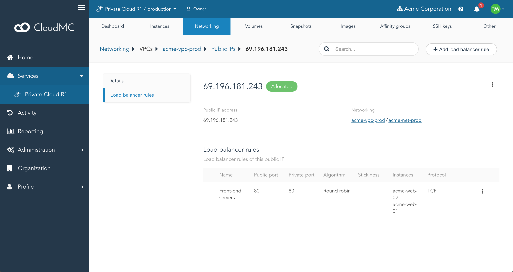
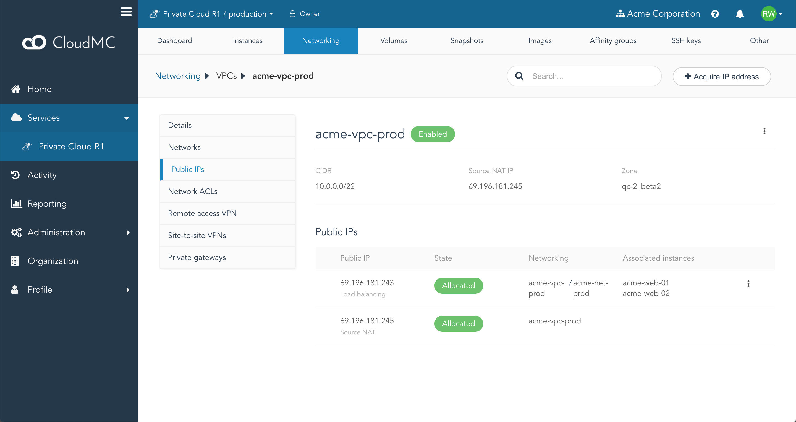

Load balancing provides a way to distribute workloads across multiple compute resources. This usually increases performance and availability through redundancy. In the context of CloudMC, this is achieved by associating load-balancing rules to a VPC's public IP address.

Only a network that was created with the **Load Balanced Tier** offering can be used for load balancing, and a VPC can have only one network configured with this offering.  You cannot configure load balancing rules on a public IP address already being used for **source NAT**, a **VPN**, or **port forwarding**.

<!-- Can add here an explanation of the algorithms and stickiness methods provided by CloudStack. -->

In the following example, we will enable load balancing for HTTP (TCP port 80) on instances *acme-web-01* and *acme-web-02* using a simple [round-robin](https://en.wikipedia.org/wiki/Round-robin_scheduling) scheduling algorithm.

1. Click on **Services** in the sidebar.
1. Select the desired compute environment.
1. Select the **Networking** tab.
1. From the target VPC's list item, click the **Public access** button.
1. Click on *Acquire IP address*.

1. You will be prompted to confirm the acquisition of a new IP address.  Click *Confirm*.  The new IP address will be allocated and listed under **Public IPs**.
1. Click on the entry for the new IP address:

1. Click on the item labeled **Load balancer rules**.  The *Load balancer rules* screen will appear:

1. Click on *Add load balancer rule*.  The *Add load balancer rule* page will appear.
1. Name your new rule, specify the public port to load-balance and the private port to forward traffic to, and select the instances that will handle traffic for the load balancer:

1. Select the desired balancing algorithm, the protocol, and the stickiness method. In this example, we don't prescribe any stickiness policy and we load-balance TCP traffic:

1. Click *Submit*.  The *Load balalcer rules* page will appear, and the new load balancer rulle will be listed:

1. Click on the *Public IPs* link in the breadcrumb and validate that the displayed information reflects your newly created rule:

1. Finally, check the load-balancing rules are working as expected by running some traffic and verify if each server is serving an equal share of the requests. One way you can achieve this is by forcing each server to return a slightly different answer (e.g.: the host name of the server) in its response (or response headers).
