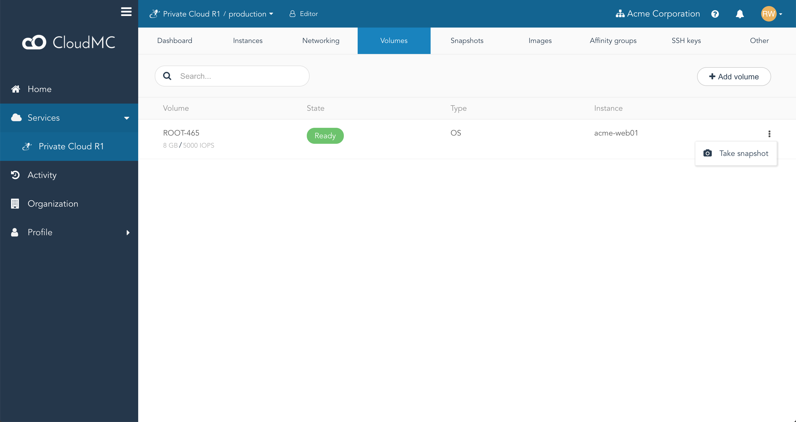
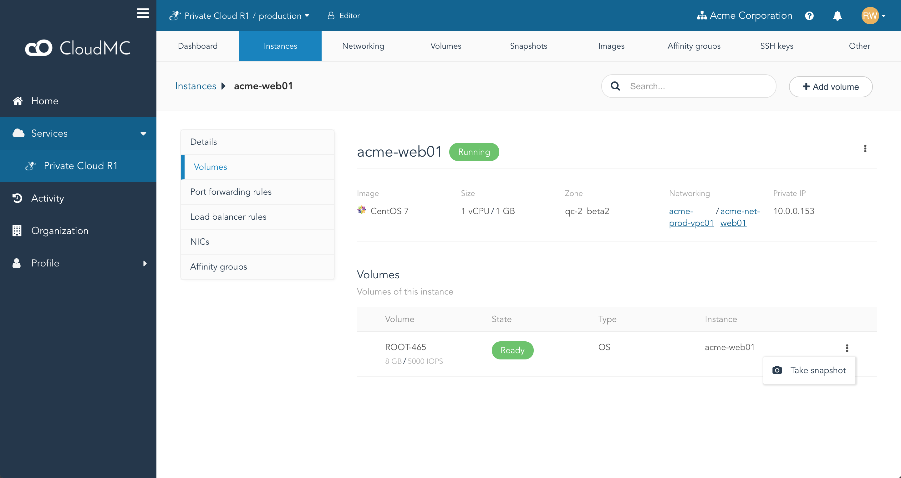
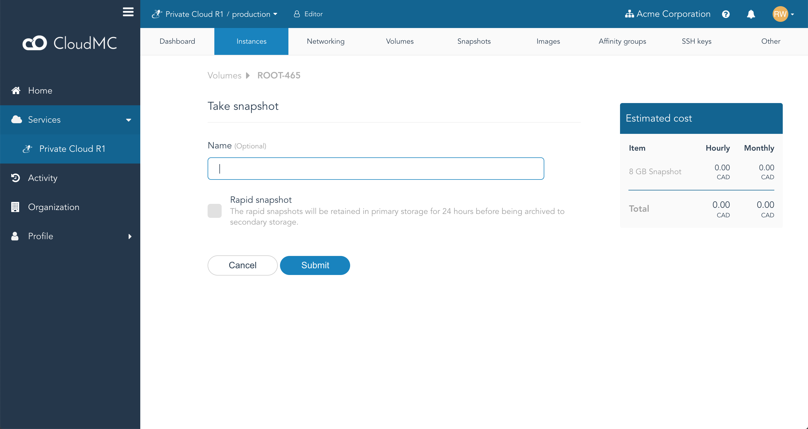

A volume in CloudMC can be used to create a **snapshot**, which is a static copy of that disk and all of its contents at the time the snapshot was taken.  This can be useful in several scenarios:
   - Rollback: When testing changes to an instance and an error occurs, the instance can be re-deployed from a snapshot taken just before the change, essentially rolling the instance back to a known-good state.
   - Golden image: An instance can be configured to a desired state, and a snapshot can be used to provision an [instance template](working-with-instance-templates.md) to be used for deploying multiple instances.
   - Troubleshooting: If troubleshooting of a production instance is necessary, a snapshot can be taken and used to create an identical instance outside of the production environment.

Both **root** volumes and **data** volumes can be used to create a snapshot.

Existing snapshots can be accessed by navigating to the desired environment, and clicking on the **Snapshots** tab.

**Note:** A snapshot is not intended to be a backup of an instance.

### Creating a snapshot from a volume

1. A snapshot can be created from a volume listed in an environment's **Volumes** tab, from a volume on an instance's details page, under the **Volumes** item, or by clicking on *Create snapshot* on the **Snapshots** page.
   - From the **Volumes** tab:
     
   - From an instance's details page:
     
1. To create the snapshot, click on the *Action* menu to the right of the volume, and select *Take snapshot*.  The *Take snapshot* page will appear:
   
1. You can choose to provide a name for the snapshot, or if the field is left blank CloudMC will automatically generate a name.  You may also choose to make this a **rapid snapshot**, see below for more details.
1. Click *Submit* to create the snapshot.
1. The **Volumes** tab will appear, and the volume chosen for the snapshot will be in the  **Snapshot in progress** state.
1. Click on the **Snapshots** tab.  The new snapshot will appear in the **In progress** state.  When the snapshot is complete, it will appear in the **Completed** state.

### Deleting a snapshot

1. Navigate to the **Snapshots** tab in the appropriate environment.
1. Click on the **Action** menu to the right of the snapshot, and click *Delete snapshot*.
1. A dialogue box will appear asking for confirmation.  Click *Submit*.
1. The snapshot will enter the **Destroying** state, and when the deletion is complete, the snapshot will be removed from the **Snapshots** tab.

### Rapid snapshots

A **rapid snapshot** can be created by selecting the *Rapid snapshot* option when creating a snapshot.  Rapid snapshots appear on the **Snapshots** page immediately and are marked with a checkmark in the **Rapid** column.  As soon as it is available, a rapid snapshot may be used as any other snapshot.  Because a rapid snapshot uses additional resources, it will be archived automatically after 24 hours, after which it becomes a regular snapshot.
