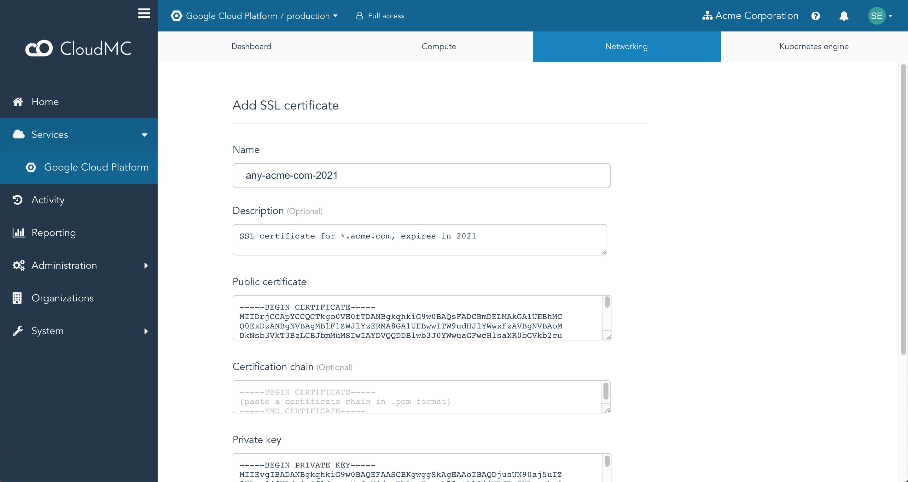
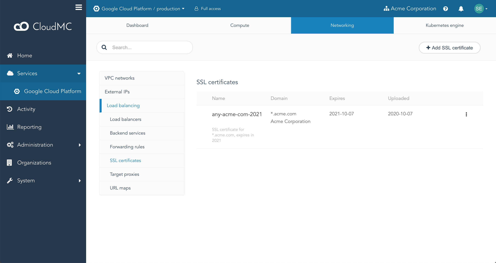

CloudMC allows you to upload an [SSL certificate](https://en.wikipedia.org/wiki/Public_key_certificate) and its associated private key to your Google Cloud Platform environment, and bind them to a **target proxy** to provide HTTPS connections to your clients.  Certificates may be signed by a Certificate Authority (CA), by an intermediate certificate, or they may be self-signed.

Currently, GCP limits SSL certificates to the following:
   - The certificate and the private key must be in PEM format
   - The private key must have no passphrase
   - The private key must be 2048-bit

SSL certificates can be managed in CloudMC by navigating to the desired GCP environment, selecting the **Networking** tab, clicking on the **Load balancing** item, and clicking on **SSL certificates**.

### Uploading an SSL certificate

1. From the **SSL certificates** page, click the *Add SSL certificate* button.
   
1. Enter a name, or accept the default, and enter a description if desired.
1. Paste the entire certificate, including the header and footer lines, into the text box labeled *Public certificate*.
1. Paste any intermediate certificates, including the header and footer lines, into the text box labeled *Certification chain*.
   - If there is more than one intermediate certificate, arrange them in order from the lowest (the certificate that was used to sign the uploaded certificate) to the highest (the certificate that was signed with the root certificate).  Leave no spaces between the footer line of one certificate and the header line of the next one.
1. Paste the private key for the certificate being uploaded.
1. Click *Submit*.
1. The certificate will now appear listed on the **SSL certificates** page.
   

### Deleting an SSL certificate

An SSL certificate cannot be deleted if it is in use by a target proxy.

1. From the **SSL certificates** page, find the certificate in the list and select the *Action* menu on the far right of the entry.  Click *Delete*.
1. A confirmation dialogue box will appear.  Click *Submit*.
1. The certificate will be removed from the GCP environment.
