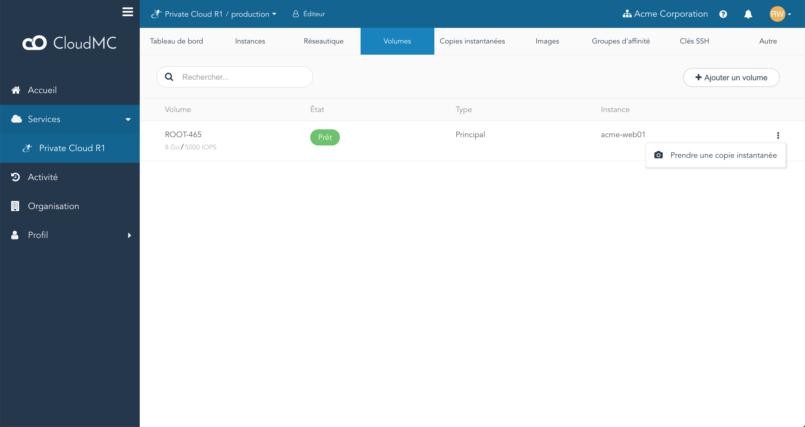
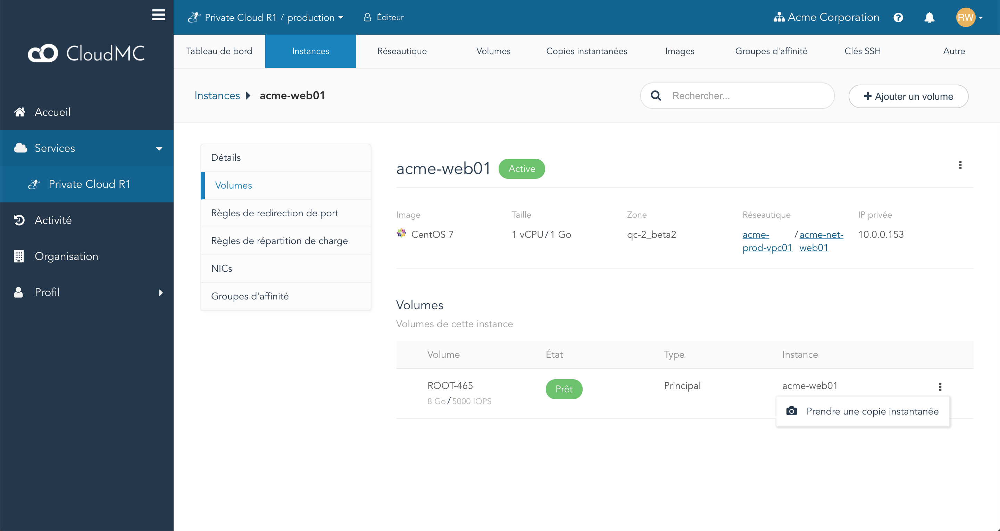
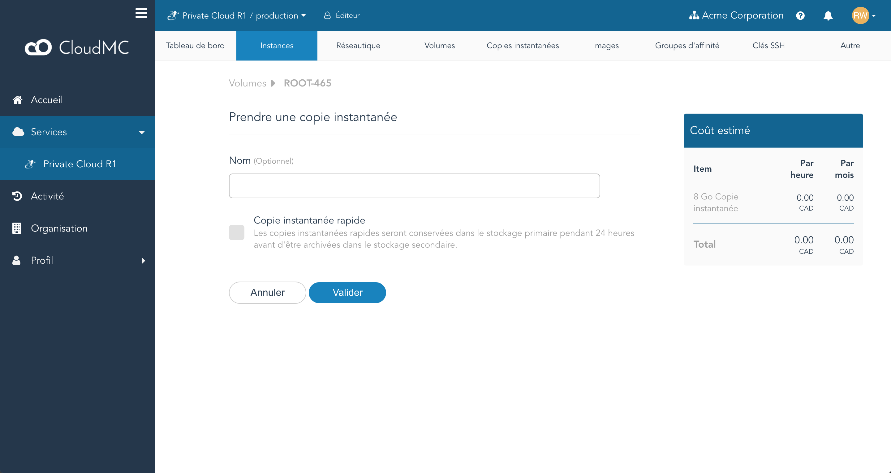

Un volume dans CloudMC peut être utilisé pour créer une **copie instantanée**, qui est une copie statique de ce disque et de tout son contenu au moment où la copie instantanée a été prise. Cela peut être utile dans plusieurs scénarios :
   - Restauration : lorsque vous testez les modifications apportées à une instance et qu'une erreur se produit, l'instance peut être redéployée à partir d'une copie instantanée prise juste avant la modification, essentiellement en ramener l'instance à un état correct.
   - Image maître : une instance peut être configurée dans un état souhaité et une copie instantanée peut être utilisé pour provisionner un [modèle d'instance](working-with-instance-templates.md) à utiliser pour déployer plusieurs instances.
   - Dépannage : si le dépannage d'une instance est nécessaire, une copie instantanée peut être prise et utilisée pour créer une instance identique en dehors de l'environnement de production.

Les volumes de genres **root** et **data** peuvent être utilisés pour créer une copie instantanée. Les copies instantanées sont stockées dans un stockage d'objets à l'échelle de la région, ce qui les rend disponibles pour une utilisation dans plusieurs zones. <!-- Take out for standard KB -->

Les copies instantanées existantes sont accessibles en naviguer à l'environnement souhaité et en cliquant sur l'onglet **Copies instantanées**.

**Avis :** Une copie instantanée n'est pas destinée à être une sauvegarde d'une instance.

### Créer un instantané à partir d'un volume

1. Une copie instantanée peut être créée à partir d'un volume répertorié dans l'onglet **Volumes** d'un environnement, à partir d'un volume sur la page de détails d'une instance, sous l'élément **Volumes**, ou en cliquant sur *Ajouter une copie instantanée* sur l'onglet **Copies instantanées**.
    - Depuis l'onglet **Volumes** :
      
    - Depuis la page de détails d'une instance :
      
1. Pour créer la copie instantanée, cliquez sur le menu *Action* à droite du volume, et sélectionnez *Prendre une copie instantanée*. La page *Prendre une copie instantanée* apparaîtra :
    
1. Vous pouvez choisir de fournir un nom pour la copie instantanée, ou si le champ est laissé vide, CloudMC générera automatiquement un nom. Vous pouvez également choisir d'en faire une **copie instantanée rapide**, voir ci-dessous pour plus de détails.
1. Cliquez sur *Valider* pour créer la copie instantanée.
1. L'onglet **Volumes** apparaîtra et le volume choisi pour la copie instantanée sera dans l'état **En cours de copie instantanée**.
1. Cliquez sur l'onglet **Copies instantanés**. La nouvelle copie instantanée apparaîtra dans l'état **Sauvegarde en cours**. Lorsque la copie instantanée est terminée, elle apparaîtra dans l'état **Sauvegardé**.

### Supprimer une copie instantanée

1. Accédez à l'onglet **Copies instantanées** dans l'environnement approprié.
1. Cliquez sur le menu **Action** à droite de la copie instantanée, puis cliquez sur *Supprimer*.
1. Une boîte de dialogue apparaîtra demandant une confirmation. Cliquez sur *Valider*.
1. La copie instantanée entrera dans l'état **Suppression**, et lorsque la suppression termine, la copie instantanée sera supprimée de l'onglet **Copies instantanées**.

### Copies instantanées rapides

Une **copie instantanée rapide** peut être créée en sélectionnant l'option *Copie instantanée rapide* lors de la création d'une copie instantanée. Les copies instantanées rapides apparaissent immédiatement sur la page **Copies instantanées** et sont marquées d'une coche dans la colonne **Rapide**. Dès qu'elle est disponible, une copie instantanée rapide peut être utilisée comme n'importe quel autre copie instantanée. À cause de qu'une copie instantanée rapide utilise des ressources supplémentaires, elle sera automatiquement archivée après 24 heures, après quoi elle devient une copie instantanée normale.
