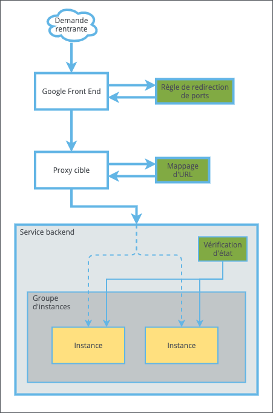

CloudMC prend en charge les fonctionnalités d'équilibrage de charge de Google Cloud Platform, grâce auxquelles le trafic peut être dirigé vers un service backend fiable avec plusieurs serveurs pour fournir une application.

L'équilibrage de charge GCP est accessible en accédant à l'environnement GCP souhaité, en cliquant sur l'onglet **Réseautique**, puis en cliquant sur l'élément **Équilibrage de charge**.

### Concepts de l'équilibrage de charge en GCP

- **Groupe d'instances** : Définit le pool d'instances qui fournissent une application ou un microservice.
- **Vérification d'état** : Définit les critères pour déterminer la disponibilité d'une instance.
- **Service backend** : Associe un groupe d'instances, une vérification d'état pour les instances de ce groupe, et le protocole à utiliser pour communiquer avec ces instances.
- **Mappage d'URL** : Spécifie à quel service backend envoyer le trafic, en fonction de l'URL de la demande.
- **Proxy cible** : Écoute le trafic sur le protocole spécifié et transfère ce trafic vers le service backend approprié, en fonction du mappage d'URL spécifié.
- **Règle de redirection de ports** : Associe une adresse IP externe, qui sert de point de terminaison de l'équilibreur de charge, un protocole, un port et un proxy cible.
- **Google Front End** :  Point d'interface entre GCP et l'Internet public.

Ce modèle permet une flexibilité significative dans les déploiements ainsi que pour la réutilisation des composants :
    - Si vous devez prendre en charge à la fois HTTP et HTTPS pour vos clients, deux proxys cibles (un pour HTTP et l'autre pour HTTPS) peuvent transférer les requêtes vers le même service backend.
    - Les connexions SSL peuvent être déchiffrées au niveau du proxy cible pour délester ce travail au backend.
    - Pour les données hautement sensibles nécessitant un chiffrement de bout en bout, les proxys cibles peuvent se connecter au backend via HTTPS.

Le diagramme suivant fournit une visualisation simplifiée des relations entre ces différents composants :

### Configurer l'équilibrage de charge GCP

Avant de configurer manuellement un nouvel équilibreur de charge, vous devez déjà disposer des éléments suivants :
    - Au moins une instance dans la région souhaitée, servant votre application ou votre microservice.
    - Un groupe d'instances dans la même région, contenant la ou les instances.
    - Une vérification d'état appropriée pour les instances cibles.
    - Un certificat SSL téléchargé, si la prise en charge de HTTPS est requise. Voir [GCP: Certificats SSL](gcp-ssl-certs.md).

#### Configuration de l'équilibreur de charge en une étape

Si un service backend a déjà été défini, CloudMC permet la création d'un équilibreur de charge sur une seule page et créera les composants nécessaires en votre nom en utilisant des valeurs raisonnables par défaut.

1. Depuis la page *Équilibreurs de charge*, cliquez sur le bouton *Ajouter équilibreur de charge*.
1. Entrez un nom pour l'équilibreur de charge ou acceptez la valeur par défaut.
1. Sélectionnez le service de backend pour cet équilibreur de charge.
1. Sélectionnez comment attribuer une adresse IP externe. Voir *Créer une règle de transfert* dans la section **Configuration manuelle** ci-dessous pour plus de détails.
1. Sélectionnez le protocole sur lequel écouter les demandes entrantes.
    - Si HTTPS est sélectionné, une liste contenant les certificats SSL téléchargés apparaîtra. Sélectionnez le certificat approprié pour cet équilibreur de charge.
1. Cliquez sur *Valider*.
1. La page *Équilibreurs de charge* s'affiche et le nouvel équilibreur de charge apparaît dans la liste.

Le nouvel équilibreur de charge est maintenant actif et prêt à être testé avec le trafic public. L'adresse IP externe de votre équilibreur de charge est répertoriée à la fois sur les pages *Règles de redirection de ports* et *Équilibreurs de charge*.

#### Configuration manuelle

1. Créez un service backend :
    - Cliquez sur **Services backend**, puis cliquez sur le bouton *Ajouter un service de backend*.
    - Entrez un nom ou acceptez la valeur par défaut, et entrez une description si vous le souhaitez.
    - Sélectionnez le protocole à utiliser pour communiquer avec le groupe d'instances. Si vous utilisez HTTPS, consultez la section ci-dessous sur l'activation de SSL.
    - Sélectionnez la vérification d'état souhaitée pour le groupe d'instances.
    - Sélectionnez le groupe d'instances souhaité.
    - Cliquez sur *Valider*.
1. Créez un proxy cible :
    - Cliquez sur **Proxy cibles**, et cliquez sur le bouton *Ajout proxy cible*
    - Entrez un nom ou acceptez la valeur par défaut, et entrez une description si vous le souhaitez.
    - Sélectionnez le protocole que le proxy cible utilisera pour écouter les demandes entrantes des clients.
       - Pour prendre en charge les connexions HTTPS des clients, sélectionnez HTTPS. Une liste des certificats SSL disponibles pour CloudMC apparaîtra sous **Protocole**, et vous devrez sélectionner celui qui convient pour cet équilibreur de charge.
    - Sélectionnez un mappage d'URL. Si aucun mappage d'URL n'a été créé, un mappage d'URL par défaut sera créé en même temps que le proxy cible.
    - Cliquez sur *Valider*.
1. Créez une règle de redirection de ports.
    - Cliquez sur **Règles de redirection de ports**, et cliquez sur le bouton *Ajouter une règle de redirection de ports*.
    - Entrez un nom ou acceptez la valeur par défaut, et entrez une description si vous le souhaitez.
    - Sélectionnez la manière dont vous souhaitez qu'une adresse IP externe soit attribuée à l'équilibreur de charge :
      - Pour allouer une adresse IP uniquement à cet équilibreur de charge et la libérer lorsque cette règle de redirection de ports est supprimée, laissez *Réserver une nouvelle adresse IP statique* décochée et sélectionnez **Éphémère** dans la liste. L'adresse IP allouée à l'équilibreur de charge **n'apparaîtra pas** dans la liste **IPs externes** de cet environnement.
      - Pour utiliser une adresse IP externe déjà attribuée dans cet environnement, sélectionnez-la dans la liste.
      - Pour réserver une nouvelle adresse IP externe qui ne sera pas libérée lorsque la règle de redirection de ports sera supprimée, sélectionnez *Réserver une nouvelle adresse IP statique*. La liste disparaîtra et une nouvelle adresse IP sera attribuée lors de la création de la règle de redirection de ports. L'adresse IP apparaîtra également dans la liste **IPs externes** de cet environnement.
   - Sélectionnez le protocole à utiliser et le port sur lequel écouter les demandes entrantes.
      - Lors de la sélection de HTTPS, un proxy cible configuré pour SSL doit exister dans l'environnement.
   - Dans la list **Proxy cible**, sélectionnez le proxy cible qui a été configuré à l'étape précédente.
    - Cliquez sur *Valider*.
1. La page *Règles de redirection de ports* apparaîtra et la nouvelle règle de redirection des ports sera répertoriée.
1. Le nouvel équilibreur de charge apparaîtra sous l'élément **Équilibreurs de charge**. Il recevra automatiquement le même nom que le mappage d'URL sélectionné.

Le nouvel équilibreur de charge est maintenant actif et prêt à être testé avec le trafic public. L'adresse IP externe de votre équilibreur de charge est répertoriée à la fois sur les pages *Règles de redirection des ports* et *Équilibreurs de charge*.

#### Activation de SSL dans le backend

Google Cloud Platform chiffre automatiquement le trafic entre l'équilibreur de charge et les services backend. Cependant, pour une sécurité supplémentaire, GCP prend en charge les connexions HTTPS entre le proxy cible et le backend. Les conditions suivantes doivent être remplies :

   - Un certificat SSL valide doit être installé sur chaque instance du groupe d'instances. Le nom commun du certificat ne doit pas nécessairement correspondre au nom d'hôte de l'instance.
   - Chaque instance du groupe doit être configurée pour utiliser HTTPS.
   - HTTPS doit être configuré comme protocole dans le service backend souhaité.

#### Supprimer un équilibreur de charge GCP

La suppression d'un équilibreur de charge GCP supprimera également automatiquement la règle de redirection des ports, le proxy cible et le mappage d'URL associés, et libèrera également les adresses IP éphémères allouées à la règle de redirection de ports.

1. Sur la page *Équilibreurs de charge*, recherchez l'équilibreur de charge souhaité et cliquez sur le menu *Action* à l'extrême droite de l'entrée. Cliquez sur *Supprimer*.
1. Une boîte de dialogue de confirmation apparaît. Cliquez sur *Soumettre*.
1. L'équilibreur de charge sera supprimé de l'environnement GCP.
