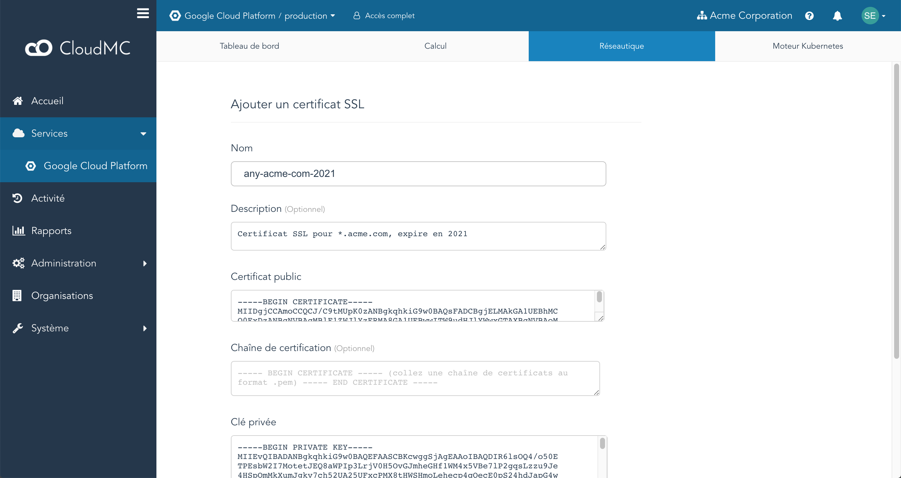
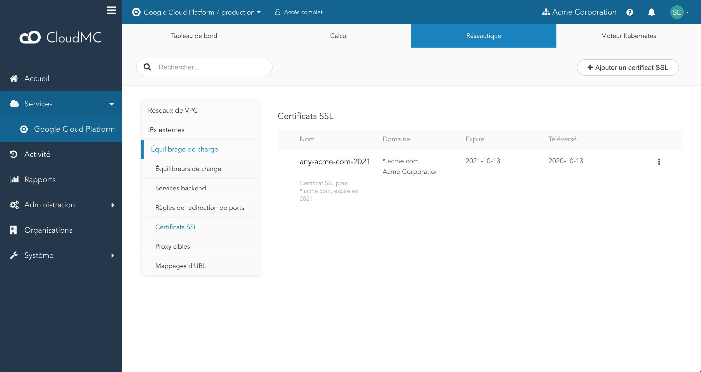

CloudMC vous permet d'importer un [certificat SSL](https://fr.wikipedia.org/wiki/Certificat_%C3%A9lectronique) et sa clé privée associée dans votre environnement Google Cloud Platform, et de les lier à un **proxy cible** pour fournir des connexions HTTPS à vos clients. Les certificats peuvent être signés par une autorité de certification (CA), par un certificat intermédiaire, ou ils peuvent être auto-signés.

Actuellement, GCP limite les certificats SSL aux éléments suivants:
    - Le certificat et la clé privée doivent être au format PEM
    - La clé privée ne doit avoir aucun mot de passe
    - La clé privée doit être de 2048 bits

Les certificats SSL peuvent être gérés dans CloudMC en accédant à l'environnement GCP souhaité, en sélectionnant l'onglet **Réseautique**, en cliquant sur l'élément **Équilibrage de charge** et en cliquant sur **Certificats SSL**.

### Téléchargement d'un certificat SSL

1. Sur la page **Certificats SSL**, cliquez sur le bouton *Ajouter un certificat SSL*.
    
1. Entrez un nom ou acceptez la valeur par défaut et entrez une description si vous le souhaitez.
1. Collez le certificat entièrement, y compris les lignes d'en-tête et de pied de page, dans la zone de texte intitulée *Certificat public*.
1. Collez tous les certificats intermédiaires, y compris les lignes d'en-tête et de pied de page, dans la zone de texte intitulée *Chaîne de certification*.
    - S'il y a plus d'un certificat intermédiaire, classez-les dans l'ordre du plus bas (le certificat qui a été utilisé pour signer le certificat téléchargé) au plus élevé (le certificat qui a été signé avec le certificat racine). Ne laissez aucun espace entre la ligne de pied de page d'un certificat et la ligne d'en-tête du suivant.
1. Collez la clé privée du certificat en cours de téléchargement.
1. Cliquez sur *Valider*.
1. Le certificat apparaîtra désormais répertorié sur la page **Certificats SSL**.
    

### Supprimer un certificat SSL

Un certificat SSL ne peut pas être supprimé s'il est utilisé par un proxy cible.

1. À partir de la page **Certificats SSL**, recherchez le certificat dans la liste et sélectionnez le menu *Action* à l'extrême droite de l'entrée. Cliquez sur *Supprimer*.
1. Une boîte de dialogue de confirmation apparaît. Cliquez sur *Valider*.
1. Le certificat sera supprimé de l'environnement GCP.
