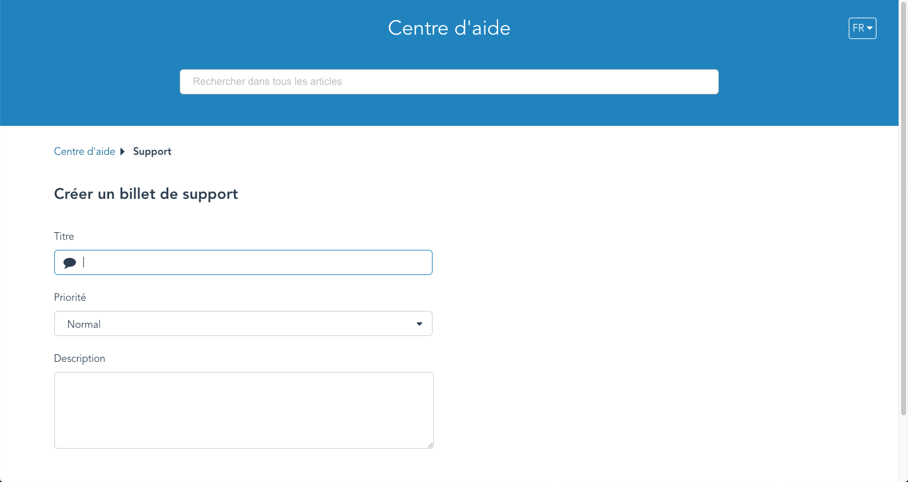

Vous n'avez pas trouvé l'information que vous recherchiez dans ces articles d'aide ou vous avez frappé un pépin? Laissez-nous savoir afin que nous puissions vous aider avec votre demande.  Cliquez simplement sur le menu d'aide en haut de la page et cliquez sur *Contacter support* :

Vous serez redirigé vers un nouvel onglet où vous pourrez ouvrir un billet de support :

Fournissez une brève description du problème dans le champ **Titre**, le niveau d'impact sur votre service dans le champ **Priorité** et dans le champ **Description** un énoncé clair du problème ainsi que le résultat souhaité.  Notre équipe de support fournira une réponse dans les plus brefs délais.
